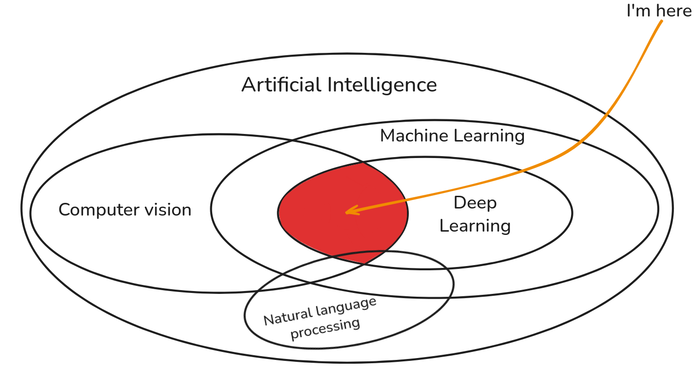

Hey! I'm Dai, a final-year Computer Science student at Hanoi University of Industry. Like many CS students these days, I got caught up in the AI wave that's basically taking over the world right now.

This blog is where I document my learning journey and the projects I'm working on. If you're also a student trying to figure out AI and deep learning, or just curious about what I'm up to, feel free to look around!

## What I'm into

I'm really interested in the intersection of computer vision and deep learning. There's something cool about teaching computers to "see" and understand images. I also dabble in NLP when I have time.

Most of my coding is in Python (obviously, since it's basically the AI language), and I know C from my earlier courses. Still figuring out a lot of things as I go!

## Why I write here

Honestly, writing about what I'm learning helps me understand it better. Plus, if someone else finds it useful, that's a bonus! I'm hoping to:

- **Share what I learn**: Maybe save someone else the headache of debugging the same issues I ran into
- **Keep track of my progress**: It's nice to look back and see how far I've come

## What's next

Right now I'm focused on landing a good internship where I can get some real-world AI experience. After that, who knows? Maybe research, maybe industry - I'm keeping my options open and seeing where this journey takes me.

## Current projects

### [kagglelink](https://github.com/bhdai/kagglelink) <small><em>(Bash, Docker, zrok, ngrok)</em></small>

_May 2024 – Present_

- Developed a solution for accessing Kaggle via SSH using zrok or ngrok
- Gained **76 stars** and **19 forks** on GitHub

---

### [BraTSAM](https://github.com/bhdai/BraTSAM) <small><em>(Python, PyTorch, PEFT, Transformers)</em></small>

_Sep 2025 – Present_

- Fine-tuned the **Segment Anything Model (SAM)** for brain tumor segmentation on MRI scans using LoRA
- Used parameter-efficient fine-tuning (peft) to create a prompt-based segmentation model
- Developed a fully automatic pipeline by training a **YOLOv8m** detector to generate prompts for SAM
- Surpassed **SOTA** brain tumor segmentation models (nn-UNet) on **BraTS GLI 2024**, achieving an average **Dice score of 0.8985**

---

### [Diffmoji](https://github.com/bhdai/Diffumoji) <small><em>(Python, PyTorch, W&B, ComfyUI, CFG)</em></small>

_Sep 2025 – Oct 2025_

- Built a Diffusion model for emoji generation from scratch
- Implemented a text-to-image Denoising Diffusion Probabilistic Model (DDPM)
- Designed a U-Net with ResNet blocks, self-attention, and feature modulation conditioned on time and text embeddings
- Integrated Weights & Biases (W&B) for real-time logging of loss, samples, and system metrics

---

### [paddy_doctor](https://github.com/bhdai/paddy_doctor) <small><em>(Python, PyTorch, timm, W&B, Gradio)</em></small>

_Dec 2024 – Feb 2025_

- Fine-tuned ResNet26d (from `timm`) to classify paddy diseases using competition dataset
- Built a Gradio web app allowing users to upload paddy images for real-time disease prediction
- Ranked in the **top 27%** of the competition with **98.6% accuracy** on the private leaderboard

---
